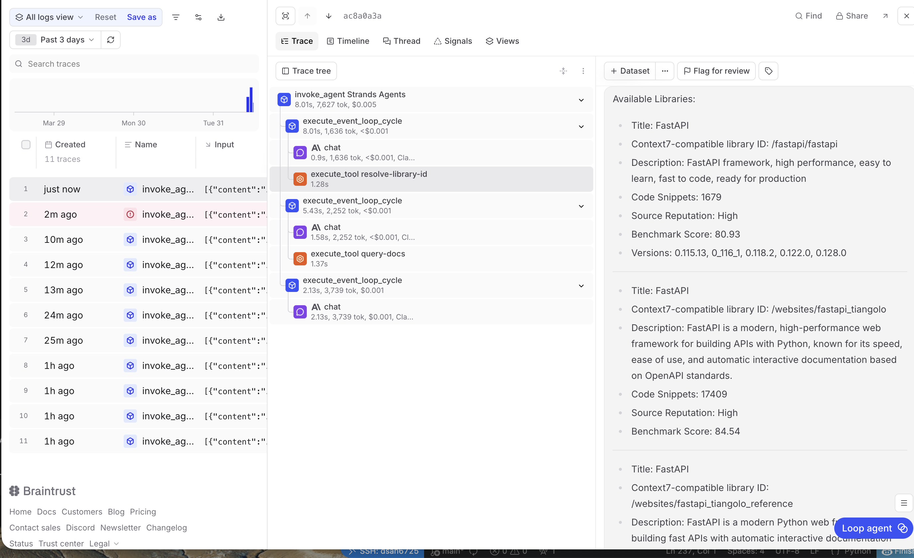

*Screenshot showing MCP tool invocation in Braintrust trace*

I connected to the Context7 MCP server and loaded its documentation search tools...

In the Braintrust traces, I observed that the MCP was successfully connected and the agent can retrive infromation about Documents of FASTapi derictly from it. 